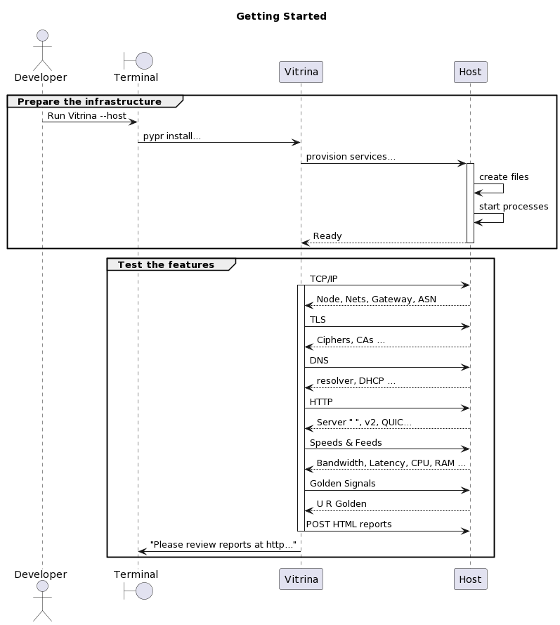

=============
About Vitrina
=============

The problem space
=================

Sometimes it is hard to show off your work. If you're a recent graduate or a seasoned Enterprise developer, you may not have samples
of your work accessible via the public internet. This is particularly true if your work does not lend itself to snazzy user interfaces.
In Spanish, the word **vitrina** means "showcase"; specifically the kind you see in department store windows. A great deal of work goes on behind the scenes to make products look appealing and much of the glamour depends on a combination of crafts, such as lighting, perspective, narration, etc.

If you manage to set up a site with some examples of your work, you may have to wrap it with work that you may not know as well, and you may not be very good at.
In that case, you risk giving the wrong impression when folks are distracted by some ancient CSS, or a TLS certificate that just doesn't behave properly.
(Ahem... hypothetically, of course.)

    - As an infra dev, you want to display your expertise and ideally, compare/contrast to show how you overcame particular challenges.
    - As a backend dev, you want to describe the activity of the infrastructure, displaying events, metrics and system status.
    - As a presenter, you want the content to appear at a consistent level of detail and a conventional layout.

The current solution
====================

As an infra dev, there are a few ways you can show your work in public:

    - Participate in an open source project and display your contributions in source.
    - Create a standalone project as a running instance and inform the viewer's interaction so that they understand how you have added value.

If you manage to set up a site with some examples of your work, you may have to wrap it with work that you may not know as well, and you may not be very good at.
So, if we assume that you're not a front-end developer, an data scientist or a network engineer, then you risk:

    - giving the wrong impression when visitors are distracted by some ancient CSS, or a TLS certificate that just doesn’t behave properly.
    - finding ways to represent activity and decide which speeds and feeds are relevant to the story you need to tell.
    - creating a configuration that might not have DNS, TLS, IP, HTTP, etc. behaving as expected.

In the best of these cases, you end up with an example that is purpose built for a particular set of dependencies.
It's not easy to change and it's hard to know what to describe because there may not be a clear distinction between the _Before_ and the _After_ .

A better solution
=================

Cloud computing is the result of interoperability between areas of competence so that each component may benefit from the services of a different resource developed by folks who are good at that particular function.

The ideal solution would provide:
    - a collection of components arranged to emulate a full stack infrastructure.
    - some automation to run a checklist and validate that the components are working.
    - a reporting mechanism to display the status and activity of the project's infrastructure.
    - a high-level orchestration of the components so that you could replace an individual component and compare the results of your changes.
    - a description of the project, structured to facilitate comparisons between versions, highlighting modifications.

We know that a full stack cloud infrastructure, must support a collection of services, each of which is routinely excercised during the course of most internet sessions.
So we begin by asserting the existence of certain features via user journeys. For example, we could follow the life of a HTTP request:

This diagrams summarizes the steps:
    - A browser fetches a URL
    - A DNS client resolves an address
    - A HTTP server gets a file
    - That HTTP server delivers a response.
    - The response contains HTML
    - The HTML contains text & graphics
    - The text and graphics contains test results
    - The test results enumerate the features.

The project should feature a default set of tools to publish the results of these transactions, along with the speed & feeds of the infrastructure performing the operations.

Practitioners of cloud computing will recognize this collection of data as :term:`Control Plane` and :term:`Data Plane` observability.

What is Vitrina?
================

Vitrina is intended to be a kit for building portfolio sites for infrastructure projects. As a kit, it provides:

    - A collection of components that will emulate a remote network hosting a simple web app
    - A set of conformance tests which output their results to the terminal and to HTML
    - Instructions for how to extend those tests so that you can include your enhancements

You can clone vitrina and set up a sample site, changing only the parts relevant to your work.
It is also a portfolio of best practices, so you can show your work in the best light, surrounded by exemplary instrumentation, automation, observability and security.

Finally, it is a set of specifications to enable folks to build a portfolio site with any tools they like,
similar to what gothinkster did with `their realword app. <https://codebase.show/projects/realworld>`_

Vitrina as a portfolio template
===============================

Given a developer has a particular expertise in infrastructure, when they want to show their work publicly, they face several systemic challenges. Vitrina intends to provide an opinionated scaffold so infrastructure developers can display their work without having to make decisions outside of their area of expertise.
The typical Vitrina user is someone who has expertise in some aspect of software development and they would like to present their work
in the best possible light. At the same time, they want to make clear what work is theirs and what is "upstream".

Vitrina as a showcase for best practices
========================================

Another target user would be the pythonista who would like to see examples of how a particular dev ops situation is handled using python.
We will try to use python everywhere. This will help us avoid some of the cross-platform annoyances with shell scripts, and Makefiles.
It will also enable us to include all the code in the same test, monitor and logging toolset.

Open source infrastructure is inherently collaborative. Vitrina aims to encourage systematic collaboration, consistent with the current best practices in cloud computing. In fact, the project takes collaboration a step forward by providing:

    - a measurable process for iterating on features
    - a structure to associate requirements with implementations
    - portability across toolchains
    - the means to answer the :ref:`4_questions`

You might not need this project...
==================================

You might have little to benefit from this project if you:
    - are satisfied that you have a way to publish examples of your work, for example, with a portfolio site.
    - do not feel concerned about the effort that it requires, or that risk that you might have to do something you're not that good at.
    - have no interest in learning how to collaborate on cloud applications.
    - have no need to associate business requirements with implementations.

Behavior Driven Development
===========================

Vitrina takes the perspective that a finished project is intended to behave in a particular manner.
The behavior of the project is described using a structure that makes it possible to parse automatically.
The process of parsing enables software components to :term:`bind`

:term:`BDD` enables you to associate the description of the feature (a :term:`claim`) with the implementation(s) (the :term:`evidence`).

Think of every change as a feature
==================================

When you pursue infrastructure as code, treat all work as code; and all code is subject to change, revision, version control, dependency management, etc.
At the (currently) highest level, start with a human readable description of the desired outcome using ``Given`` , ``When`` , ``Then`` syntax .

For example, when there are some pages which a user must log in to see.

.. code-block:: gherkin

    Scenario:
    """Some pages require authentication, other pages do not.
    """
    Feature: User authentication for some pages
      Scenario: A page requires Authentication
        Given The server receives a request for a protected page
        When The request does not have authZ
        Then The server denies access to the page.

Next, we develop step functions in a machine language (for Vitrina, we try to use Python everywhere). In the case of a new refactor, we can use the same ``feature`` files ( :term:`acceptance tests`) with the current ``step`` , and then with the new version. This brief description doesn't scratch the surface. There is an excellent overview on the `cucumber site <https://cucumber.io/docs/bdd/>`_ , which we recommend if you want to write new features.

Evidence-based Product Management
==================================

Where :term:`claims` about progress are replaced by :term:`evidence` about progress.

When we establish an automated relationship between the requirement and the implementation, we get closer to managing progress based on evidence, rather than claims.
`Richard Cook's 2012 presentation at Velocity <https://youtu.be/2S0k12uZR14>`_ discusses the problem of managing the difference
between the "system as intended" and "the system as it is."
The implementation of Vitrina aims to be an example of how product owners can understand the system as it is with greater certainty.

.. _4_questions:

The four dimensions of a software artifact
==========================================

This is where the Vitrina project steps into new territory.
The structure of the conformance tests take into consideration four scenarios.
If you decide to consider these four scenarios when you add a feature, you will be regarded as outstanding.
Here, the word *feature* refers to whatever is being added/changed to the project.

.. warning:: This section could change your life as a developer. Consider this before you proceed, there is still time to turn back.

Outside of school, software specifications will tend to look a bit differently.
Very often, they will overlook topics that you might have covered in the textbook.
The topics have names like  "diagnostic criteria", "failure modes", "quality indicators", "usage metering", "dependency management".

In general, those topics exist to answer these four enduring questions:

    1. (Success) How can I tell if it's working?
    2. (Failure) What happens when something goes wrong?
    3. (Quality) How much better is the new version than the previous?
    4. (Accounting) How can I tell if anyone is using the feature?

Why are these four questions difficult for cloud developers?
============================================================

When cloud development makes heavy use of virtualization, abstraction and packaging of dependencies; the behavior of an artifact (your project) may change because of the assumptions you made about where it was running.
These assumptions lead to the "works-on-my-machine" anti-pattern. There is often a discrepancy between the "system as intended"
and the "system as it is".
If you can address the four questions when you build your artifact, you will increase the likelihood that production users (anyone other than you) will be successful.

Architectural Decision Records
==============================

Why do we choose one thing and not the other?
Is there something that might cause cause us to revisit this decision in the future?

An architectural decision record (:term:`ADR`) is a set of facts describing the items we take into consideration when we choose to do one thing and not another.
Just as linking the requirement (``feature``) to the implementation (``steps``) is an evolutionary process, so is noting when we make a decision.
I wonder if there is a way to associate scenarios (or other objects) with decision records.
For now, we would like to be able to associate aspects of a feature with the decisions and tradeoffs considered at that time, so that:

    - new product managers don't duplicate prior efforts.
    - so that developers can understand dependencies more quickly
    - decisions	 can be aggregated and reasoned about as category with its own properties
