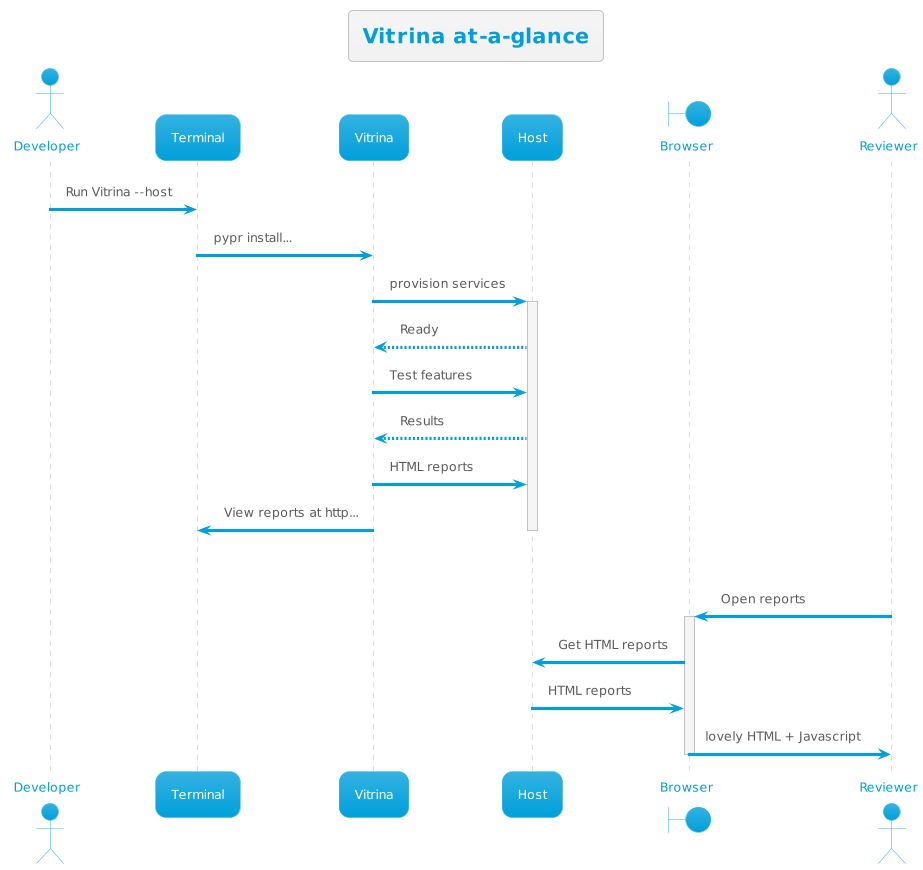

=============
About Vitrina
=============

At its core, Vitrina is a collection of opinionated tests which inspect infrastructure resources, collect the results, populate HTML reports and serve them up as a web app. If you extend the tests to cover some enhancement, you will be able to compare and contrast the results.

 This doc describes how to use Behavior Driven Development (BDD) to build , document, and run a working model of cloud infrastructure with the ability to showcase your work and compare it with others.

.. toctree::

    about
    signals
    faq
    futures

